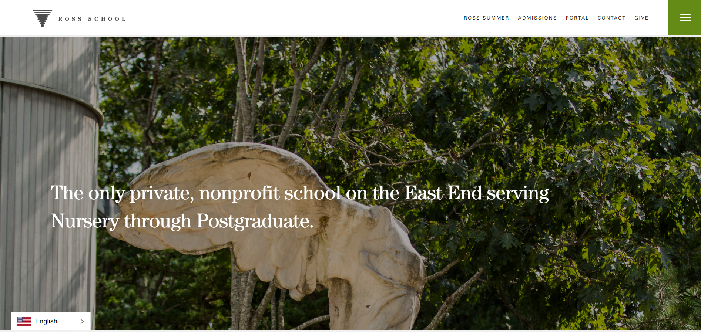
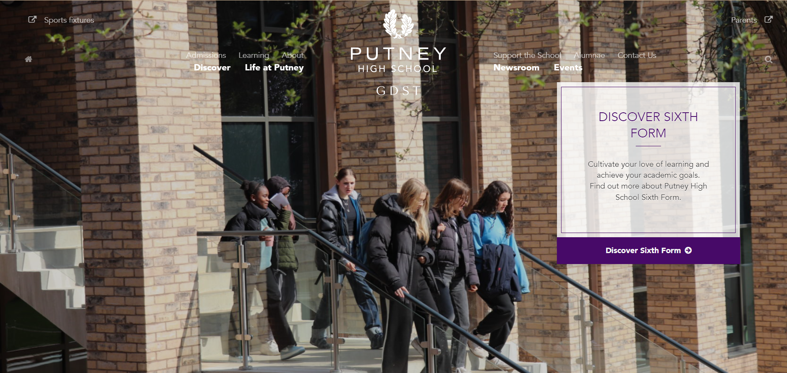
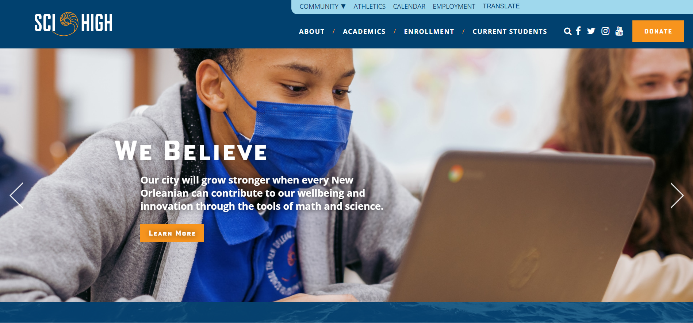
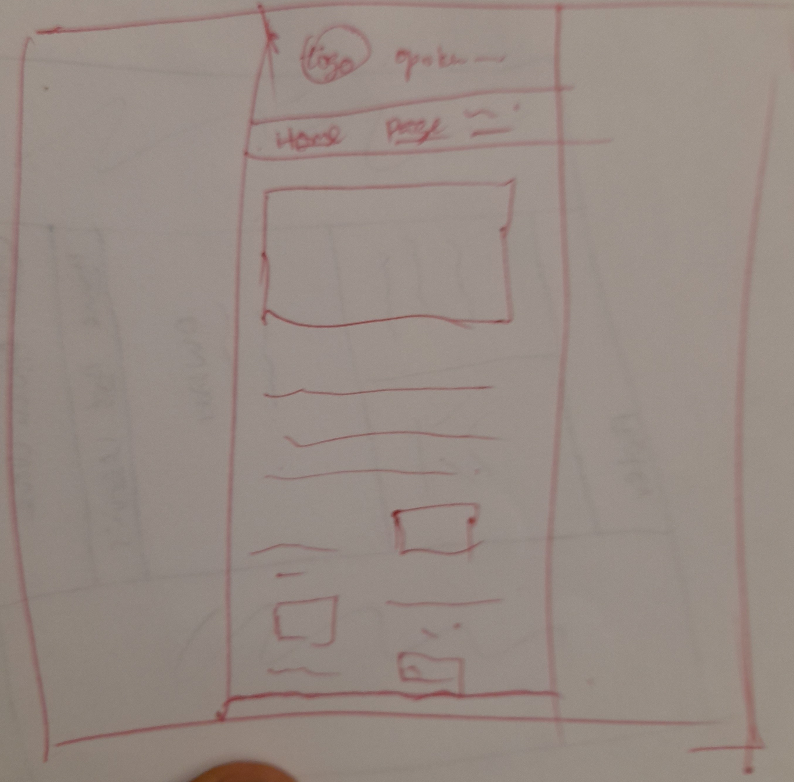
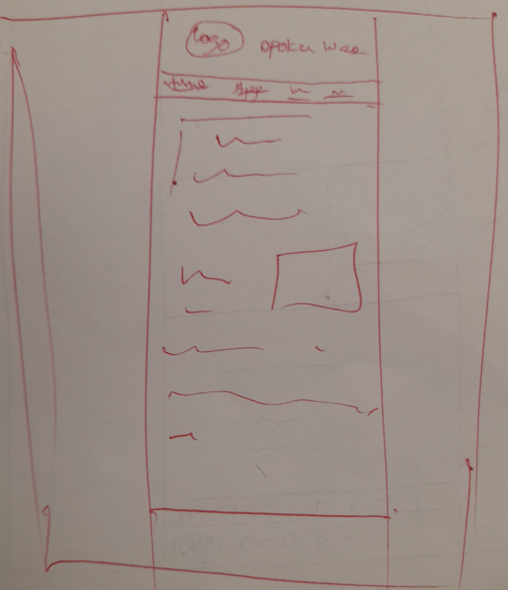
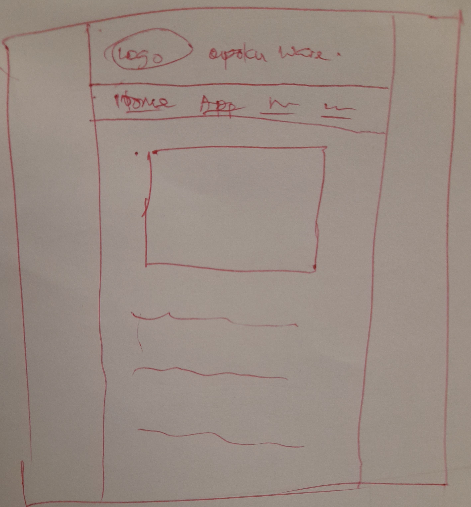

# Project 1: Design Journey

**For each milestone, complete only the sections that are labeled with that milestone.** Refine all sections before the final submission.

You are graded on your design process. If you later need to update your plan, **do not delete the original plan, leave it in place and append your new plan _below_ the original.** Then explain why you are changing your plan. Any time you update your plan, you're documenting your design process!

**Replace ALL _TODOs_ with your work.** (There should be no TODOs in the final submission.)

Be clear and concise in your writing. Bullets points are encouraged.

**Everything, including images, must be visible in _Markdown: Open Preview_.** If it's not visible in the Markdown preview, then we can't grade it. We also can't give you partial credit either. **Please make sure your design journey should is easy to read for the grader;** in Markdown preview the question _and_ answer should have a blank line between them.

## Markdown Instructions

This is a Markdown file. All written documents that you will submit this semester will be Markdown files. Markdown is a commonly used format by developers and bloggers. It's something that you should know. Learning it is a learning objective of this course.

**Please use the official [Markdown Reference Documentation](https://commonmark.org/help/) if you aren't sure how to "code" Markdown.**

This is an example for inserting images into Markdown:

## Personal Site (Milestone 1)

### Website Topic (Milestone 1)

> Briefly explain what your website will be about. Share your vision of your personal website.
>
> Example:  My website will be about the Grassroots festival in Trumansburg NY.

**My website will be about information about the admission process of Opoku Ware School, and other important information that an applicant needs to know about the school.**

### Device (Milestone 1)

> How you will your audience likely access your website? On a laptop/desktop computer or a mobile device?
> You will design your website for mobile or desktop devices (not both).

**Desktop site.**

## Personal Website Design Exploration (Milestone 1)

Identify three personal websites (preferably static websites) that exist today on the web. You will be drawing inspiration from these sites for your own site; please select websites that are similar to the website you wish to create.

Include a screenshot of the home page for each site. If you're planning a mobile website, your screenshots should be from a mobile website. If you're planning a desktop website, your screenshots should be from a desktop website.

**We'll refer to these are your "example websites."**

1. <https://www.ross.org/>

    

2. <https://www.putneyhigh.gdst.net/>

    

3. <https://noscihigh.org/>

    

### Personal Website 1 Review (Milestone 1)

> Review the personal website you identified above. (1-2 paragraphs)
>
> - Who do you think this site is designed for? Who is its intended audience?
> - What **goals** do you think the audience likely has when visiting this site.
> - What **content** is included?
> - Do you believe the content likely **addresses** the goals of the site's audience?
> - What do you like about the design?
> - Is the site designed for desktop, mobile, or desktop and mobile devices?

- **The site is designed for students from nursery to postgraduate.**

- **The audience wants to learn about the admission process of the school, and resources that the school has to promote education, and academics of the school.**

- **The website contains webpages that have information about the admission process for senior high school students, contacts of some officials of the school, links to donate to support the school as it is a non-profit organisation, and resources for summer vacations.**

- **Not completely. The website doesn't have enough content. It doesn't have webpages that gives information about the curriculum of the school. Some important resources cannot be accessed by applicants.**

- **I like the color, and images.**

- **Desktop and mobile devices.**

### Personal Website 2 Review (Milestone 1)

> Review the personal website you identified above. (1-2 paragraphs)
>
> - Who do you think this site is designed for? Who is its intended audience?
> - What **goals** do you think the audience likely has when visiting this site.
> - What **content** is included?
> - Do you believe the content likely **addresses** the goals of the site's audience?
> - What do you like about the design?
> - Is the site designed for desktop, mobile, or desktop and mobile devices?

- **The site is designed for girls interested in enrolling as high school students.**

- **The audience wants to learn about the admission process of the school for senior high school students, useful resources of the school to support senior high school education, how the school supports girl-child education, and the academics of the school.**

- **The website contains webpages that have information about the admission process for senior high school students, life at putney as senior high school student, the senior high school curriculum of the school, information about other academic resources not beyond the curriculum such as scholarships.**

- **Yes. It has links to other webpages that have needed information**
- **I like the color, images, and structure of the homepage. I also like the information spelt out on the Life at Putney webpage.**
- **Desktop and mobile**

### Personal Website 3 Review (Milestone 1)

> Review the personal website you identified above. (1-2 paragraphs)
>
> - Who do you think this site is designed for? Who is its intended audience?
> - What **goals** do you think the audience likely has when visiting this site.
> - What **content** is included?
> - Do you believe the content likely **addresses** the goals of the site's audience?
> - What do you like about the design?
> - Is the site designed for desktop, mobile, or desktop and mobile devices?

- **The site is designed for students interested in enrolling into the school with interest in science and math.**

- **The audience wants to learn about the admission process of the school for senior high school students, useful science and math resources of the school for senior high school education, and the academics of the school.**
- **The website contains webpages that have information about the admission process for senior high school students, life of current students, the rigor of the senior high school curriculum of the school, information about other academic resources not beyond the curriculum such as scholarships, achievements of the school, and helpdesk.**

- **Yes. It has links to other webpages that have needed information**
- **I like the color, images, and structure of the homepage.**

- **Desktop and mobile**

## Audience & Goals (Milestone 1)

Using what you learned from studying the example websites, identify your website's audience and their goals.

### Audience (Milestone 1)

> Briefly explain who the intended audience is for your website. Be specific and justify why this audience is appropriate for your site's topic.

**Junior high school male student from a low-income family with interest in science and math who is interested in applying to Opoku Ware School( an all boys high school).
The audience is appropriate because the main information that the website provides is the admission process of Opoku Ware School, resources in the school that support science and math education and resources in the school that support a low-income student.**

### Audience Goals (Milestone 1)

> Why would your audience visit your site?
> Identify at least 3 goals that your users have for visiting your website.

1. **To read information about the admission and admission process of Opoku Ware School.**

2. **To read information about resources in the school that supports science and math education.**

3. **To read about resources in the school that support all-boys education.**
4. **To read about the curriculum of the school.**
5. **To read about useful resources that support low-income students.**

## Content Planning (Milestone 1)

Plan your site's content.

### Your Site's Planned Content (Milestone 1)

> List **all** the content you plan to include your personal website.
> You should list all types of content you planned to include (i.e. text, photos, images, etc.)

- Pictures of Opoku Ware School and its students.(image).
- Contacts of admission office and financial aid office(text).
- Admission process for low-income students(text).
- Financial aid process for low-income students(text).
- A little background and achievements of Opoku Ware School(text).
- Scholarships and financial aid the school provides.(text)
- Science and math resources in the school.(text and image)
- Life as a low income student in the school(text).
- Curriculum of the school(text).
- Comments from current students, past students, and other people who were low income students in the school.(text)

### Content Justification (Milestone 1)

> Explain (about a paragraph) why this content is the right content for your site's audience and how the content addresses their goals.

It is the right content because the audience needs to know if the school is a good fit for him. As a low income student, he wants to know if the school can provide him with financial aid. He wants to know if the school has enough science and math resources because he is interested in science and math. It might be that the junior high school of the applicant was a co-educational institution, or a single-sex school. Because Opoku Ware School is a single sex school, the applicant might want to know how life at Opoku Ware School is. The content stated above provides all the information the applicant might want to know about the school and that if the school can provide with him all his needs.

### Home Page Content (Milestone 1)

> What is the content that your users would expect when visiting your site for the first time.

- Pictures of Opoku Ware School and its students.(image).
- Contacts of admission office and financial aid office(text).
- Admission process for low-income students(text).
- Scholarships and financial aid the school provides.(text)
- Science and math resources in the school.(text and image)
- Life as a low income student in the school(text).
- Comments from current students, past students, and other people who were low income students in the school.(text)

> Briefly identify what content you will include on the homepage and why this content should be the first thing your target audience sees when they visit your site.

- Background pictures of Opoku Ware School and its students.(image).
- Testimonials of current students, and past students who were low income students in the school.(text)
- Text that states the school's mission of supporting low-income students with interests in science and math.
- Quick links to the webpages of the websites.
- The address of the school.
- The name and logo of the school.
- Picture about the impact of the financial resources of the school.
- Statistics about the impact of the financial aid opportunities in the school.

## Information Architecture (Milestone 2)

For milestone 2, you will design the information architecture for all the pages your website.

You may change your homepage content based on your card sorting. If you do change the homepage content, don't update it above, just include the new plan in the section below (Content Organization).

### Content Organization (Milestone 2)

> Document your **iterations** of card sorting here. You must have at least 2 iterations of card sorting.
> Include photographic evidence of each iteration of card sorting **and** description of your thought process for each iteration.
> Please physically sort cards; please don't try and do this digitally.

#### For iteration 1

.jpg)
Each one of this set of papers in iteration 1 has information about financial aid. Hence, it is appropriate to group them together into one page. Even though the image about Opoku Ware Scholar's Program in this iteration also has information about financial support, addition of the image about Opoku Ware Scholar's Program to this set of cards will make the webpage lengthy, resulting in difficulty in navigating through the webpage.
.jpg)
This set of papers has collective information about science and math resources that the audience might need to know.
.jpg)
This set of papers has collective information that can be grouped to make a homepage for the website. They contain information that the audience might need to know immediately he or she enters the website. It has information that draws the attention to continue reading through the website.
.jpg)
This set of papers has collective information about Opoku Ware Scholar's Program. Even though it has information about financial aid, it is separated from the financial aid section because there are so much information in this section so addition to the financial aid section will make the webpage lengthy. Therefore, the " HOW TO APPLY", links this section to the other section about financial aid.

#### For iteration 2

.jpg)
This set of papers has collective information that can be grouped to make a homepage for the website. They contain information that the audience might need to know immediately he or she enters the website. It has information that draws the attention to continue reading through the website.
.jpg)
This set of papers has collective information about science and math resources that the audience might need to know.
.jpg)
Each one of this set of papers in iteration 1 has information about financial aid. However, I do not prefer like this group because it has so much information on one webpage which will make the webpage lengthy. It is there appropriate to divide the separate this group into two different groups with manageable information and texts that can be it easier for the audience to read through the page.

### Final Content Organization (Milestone 2)

> Which iteration of card sorting will you use for your website?

I will use the first iteration of cards.

> Explain how the final organization of content is appropriate for your site's audiences.

Each set of papers has related information that the audience needs. The length of the text that each set of papers in this iteration provides in the webpages is not be too long. Such manageable length will help the reader navigate through the webpages easily.

### Navigation (Milestone 2)

> Please list the pages you will include in your website's navigation.

- Learning.
- Apply for Aid.
- Financial Aid
- Home

> Explain why the names of these pages make sense for your site's audience.

- The names of these pages are concise and summarizes the content of the webpages in few words.

## Visual Themes (Milestone 3)

**Make the case for your decisions using concepts from class, as well as other design principles, theories, examples, and cases from outside of class.**

Remember to focus on the things we can't see just by looking at the site: changes, alternatives considered, processes, and justifications.

Each section is probably around 1 reasonably sized paragraph (2-4 sentences).

### Theme Ideas (Milestone 3)

> Discuss several (more than two) ideas about styling your site's theme. Explain why the theme ideas are appropriate for your target audiences.

I prefer:

- a light angel blue color to dominate most part of the webpages. With light angel blue color as the background color of most elements in the pages, blue black color or deep blue color can be a good choice for the color of the texts. Since the logo of the school has yellow and blue colors, those two colors can be used to design some elements in the webpages. The angel blue color makes it possible for yellow and blue colors to be included in the color theme of the website because yellow and blue colors can easily distinguish themselves from the light angel blue color. The combination of the angel blue color, and dark blue color evokes a neutral technical feeling and while the addition of yellow, and blue colors add friendliness to the technical emotion. Because the website is related to school stuff, it is appropriate that the colors of the website evokes technical feelings. However, since the website is mainly build for junior high school students, the colors of the website should evoke a friendliness emotions, making the design of the website less technical.
- Some of the texts especially the headings should be stylish fonts. The text of most paragraphs can be less stylish. The combination of more stylish and less stylish fonts will make the web pages appear technical but also friendly.
- A mixture with shapes with sharp vertices and shapes with slightly curved vertices can create the neutral technical but neutral emotions.
- Also, because the color of the uniform of the school is cream and brown, adding such colors to the webpages would be great. Therefore, I intend to change the body to have a creamish background color, and a brown navigation bar to reflect the colors of the school.( made these changes after grading)

### Final Theme (Milestone 3)

> Which theme did you select as your final theme? Why?

I select a technical but a little friendly theme because the audience expect to get information related to school. Such information is technical and evokes serious emotions. However, a little friedly theme added to the overall theme will reduce the tensed emotions. And because the audience is also in search for financial support, there's a need that the theme provides some kind of friendliness and support.

### Theme Rationale (Milestone 3)

> Discuss your final theme design: how do they fit your overall design goals and audiences?

The main information that my audience want to get from the website is related to school. It is therefore great if the theme of the website is both more technical and a little friendly. This theme will create a kind of neutral theme but a little technical.

> Emotion is a big part of design. What emotions were you thinking about or trying to convey in your designs?

I tried to convey a mixture of friendly and technical emotion.

## Layout & Composition (Final Submission)

### Home Page Layout (Final Submission)

> Include several sketches of possible layout ideas for the home page.
> Provide an explanation for each sketch explaining the idea.
> Show your design process.
> **Use the example websites above as inspiration for your site's design.**

- For home page layout 1
  
  All the logo, and the navigation are in line. They form the header of the homepage. This will help the user navigate through the website easily as the navigation is found right at the upper part of the homepage. This layout also has image that are in line with texts that the image refer to.

- For home page layout 2
  
  This layout has the navigation and logo of the homepage on different lines. This will help the user navigate through the website easily as the navigatoin is found right at the upper part of the homepage.
  The content of the body too is spaced from the edges of the home page. This promotes the readibility of the homepage as the content is centered on the page, and the texts have short lengths.
  

- For home page layout 3
  
  This layout has the navigation and logo of the homepage on the same line and at the top of the homepage. This will help the user navigate through the website easily since the navigation bar can be found right at the top of the homepage. Most of the content of this layout apart from the header are arranged vertically. This increases the height of the homepage and creates more empty spaces in the homepage making it difficult and boring to read through the page.
  

### Final Site Design (Final Submission)

> Include a sketch of the final layout for each page in your site.
> Provide an explanation below each sketch.

- Home
  
  I prefer this homepage:
  It has the header has the nagivation found at the top of the homepage, which will help the user to navigate through the website easily. It has some of its content arranged horizontally which won't increase the length of the homepage and hence increases easiness in reading the homepage. It has its content centered and spaced from the edges of the webpage which sufficiently condenses the content of the webpage creating little empty spaces in the content and enhancing readability.
- Learning
  
  I prefer this layout:
  The webpage has a lot of information arranged in short paragraphs, which makes it less attractive. It would be great if an image of studying students is added to the top of the webpage under the header to make the page catchy. An image of studying students is preferrable because the weboage is about learning and curriculum. The image is big and centered to take most space the page when the audience first gets into that page, which will draw the audience to further read the rest of the page. Down the page, some of the paragraphs have images attached to those paragraphs, It would be great if each image and paragraph pair are arranged in the same line. However, the images should not be arranged in the same line accross the page( in other words, the texts and images should alternate) to increase the readability of the webpage. 

  
- Financial Aid
  
  I prefer this layout:
    The webpage has a lot of information arranged in short paragraphs, which makes it less attractive. It would be great if an image related to some of the text in the webpage. An image of Opoku Ware Scholars is preferrable because gives more information about the Scholars Program. The image is small to give room for more information to be added to the webpage.
    The webpage has a lot of spaces to improve readability since it contains more information. 

- Apply for Aid
  
  I prefer this layout:
    The webpage has a lot of lists, which makes it less attractive. It would be great if a big image relating to money is added to the top of the webpage under the header to make the page catchy. An image of the piggy bank is preferrable because the webpage is about finance and its friendly. The image is big and centered to take most space the page when the audience first gets into that page, which will draw the audience to further read the rest of the page.
    Because the page has a lot of lists items, it is already readable enough for the audiences.

### Static Website Design Check (Final Submission)

> We're building a static website without interactivity.
> **No part of your website may dynamically change.**
> Examples of dynamic behavior are dropdown menus, hamburger menus, popups, modals/lightboxes, image carousels, etc.
>dfd
> Audit your design and check that you aren't relying on any dynamic features.

My website is static because all the content are fixed and they do not change with time, user, and location. The navigation doesn't change. There are no dropdown menus, hamburger menus, popups, modals/lightboxes, image carousels or any other dynamic feature.

## Rationale (Final Submission)

**This rationale should be polished writing:** one you might submit as a report to a client or boss to help explain the project and convince them you did a good job. You'll be surprised how much writing and communicating you need to do about projects and choices on internships and jobs; practice that here.

It should be a comprehensive, complete story of the project. You might find that each section runs a few paragraphs (1-2). Sketches can often help tell the story of your design. Screenshots are also useful for describing issues discovered during the design process and how you addressed them.

**All images must be visible in "Markdown: Open Preview" for credit!**

This project is a website designed for students who are male, who want to pursue science and math in high school, but are in need of financial support for their education. Based on the interests of the audiences, th website provides information about a school that has resouces that can satisfy the needs of the audiences. Even though there are so many resources in the school, the website provides information about ones the audiences need. 

The website has information about financial aid opportunities in the school and how the audiences can apply for the opportunities. It has information about the science and math resources in the school that can support the audiences as people who have interests in science and math. And because the audience would want to attend the school, the website provides information about the science and math curriculum of the school.

Finally, website has useful minor information like contacts, addresses, visions of the school and school's offices, and pictures of important areas of the school that can help the audiences. All these content are well-arranged to help the audiences navigate and read through the website easily. The website is well designed to make the audience have friendly emotions while the technical nature is maintained.  

Your rationale should be a polished version of the earlier explanations.

### Audience (Final Submission)

> A complete and polished description of the intended audience(s) for your website.

This website is designed for students who are males with interest in studying science and math, and intend to attend Opoku Ware School, but can't support their education financially.

### Design Goals (Final Submission)

> An explanation of the design goals for that audience, based on your earlier rationales.

The colors of the website reflect the colors of the school. The bright colors, mixture of stylish font, and sharp tips of images will evoke a mixture of technical and friendly emotions.The content of the webpages spaced from the edges of the webpage will increase the readibility of the webpage.

### Content Organization & Navigation (Final Submission)

> An explanation of how the final content organization and navigation met your goals and why it's appropriate for your audience. 

The website has webpages with related contents that will help the user to find information easily in the website. The webpages have names that summarize the content of each webpage which will help the user to find information easily in the website. The "Apply for aid" page has information that the user can use to apply for financial aid, the "Learning" page has information about the science and math curriculum of the school, and "Financial Aid" page has information about the various financial aid that the school can provide for the audience. These contents are appropriate because gives information about that address the needs of the audience.

### Visual Design (Final Submission)

> An explanation of how the final design met your goals and why it's appropriate for your audience.

The final design has colors of Opoku Ware School which gives a little information about the culture of the school. The design has bright colors and a little bit of stylish font that gives a friendly feeling while most of the font style of the texts are not stylish which maintains the technical nature of the website. It is appropriate because the audience is a young student and there's a need for the website to be friendly. However, because the website is about a school, it should maintain its technical nature.

### Self-Reflection (Final Submission)

> Take some time here to reflect on how much you've learned since you started this class. It's often easy to ignore our own progress. Take a moment and think about your accomplishments in this class. Hopefully you'll recognize that you've accomplished a lot and that you should be very proud of those accomplishments!

## Grading (Final Submission)

### Mobile or Desktop? (Final Submission)

> Should the graders, grade your site as a desktop site or a mobile site?

Desktop

### Grading: Open the Design Journey in Markdown: Open Preview (Final Submission)

> Preview your design journey in VS Code. Please verify that this document is easy to read/grade.
>
> - Remove all _TODOs_
> - All images must be visible.
> - All images must be oriented the correct way.
> - There should be a blank line between the question prompt and your answer.
>
> Is your design journey easy to read?

Yes, it
### Collaborators

> List any persons you collaborated with on this project.

### Resources

> Please cite any external resources you used in the creation of your project.

<https://kesslerscholars.org/>

<https://finaid.cornell.edu/types-aid/work>
